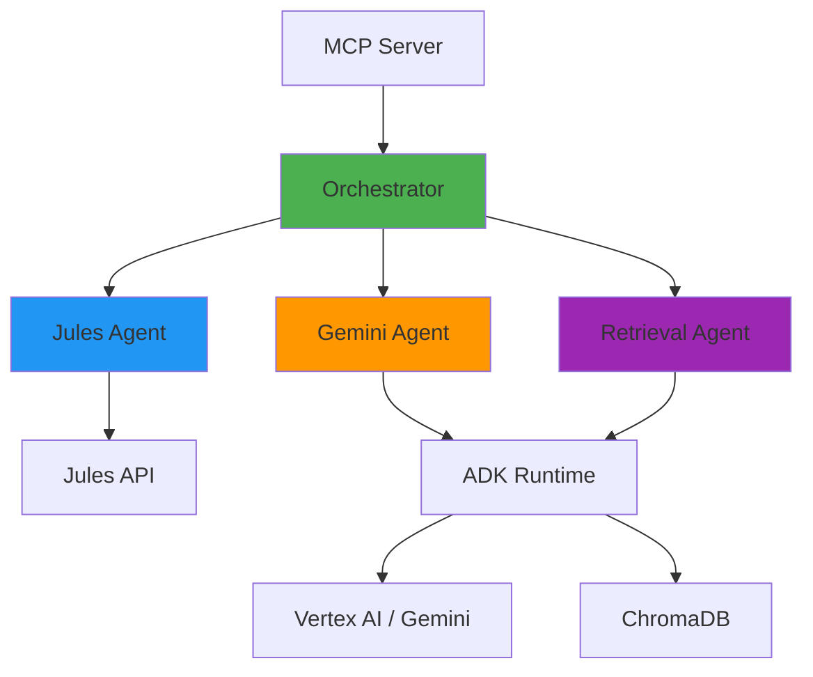

# Agent Registry

> **Coordinate Jules, Gemini, and custom AI agents with powerful orchestration patterns**

Agent Registry is a Kubernetes-native platform for managing and orchestrating AI agents. It provides a unified interface for discovering, deploying, and coordinating multiple AI agents through the Model Context Protocol (MCP).

## ✨ Features

- 🤖 **Multi-Agent Orchestration**: Coordinate Jules, Gemini, and custom agents
- 🔄 **Flexible Patterns**: Supervisor, Swarm, and Workflow execution
- 🔌 **MCP Integration**: Model Context Protocol server for agent discovery
- ☸️ **Kubernetes Native**: CRDs for agent catalogs and deployments
- 🚀 **Production Ready**: Built for scale with observability

## 🏗️ Architecture



## 🚀 Quick Start

```bash
# Install Agent Registry
kubectl apply -f https://github.com/agentregistry-dev/agentregistry/releases/latest/download/install.yaml

# Deploy an agent
kubectl apply -f - <<EOF
apiVersion: agentregistry.dev/v1alpha1
kind: AgentCatalog
metadata:
  name: gemini-agent
spec:
  displayName: "Gemini AI Agent"
  agentType: "gemini"
  capabilities:
    - code_generation
    - research
EOF
```

## 📚 Documentation

- **[Getting Started](getting-started/README.md)**: Installation and configuration
- **[Architecture](architecture/README.md)**: System design and components
- **[Agents](agents/README.md)**: Available agents and capabilities
- **[Orchestration](orchestration/README.md)**: Coordination patterns
- **[MCP](mcp/README.md)**: Model Context Protocol integration
- **[API Reference](api/README.md)**: HTTP API and Kubernetes CRDs

## 🎯 Use Cases

### Autonomous Git Operations
Use Jules agent to autonomously create pull requests, make code changes, and manage repositories.

### Multi-Agent Research
Coordinate Gemini and Retrieval agents to perform comprehensive research and analysis.

### Code Generation Pipeline
Chain agents together to research, generate, and deploy code changes.

## 🤝 Contributing

We welcome contributions! See [CONTRIBUTING.md](../CONTRIBUTING.md) for guidelines.

## 📄 License

Apache 2.0 - See [LICENSE](../LICENSE) for details.

## 🔗 Links

- [GitHub Repository](https://github.com/agentregistry-dev/agentregistry)
- [Issue Tracker](https://github.com/agentregistry-dev/agentregistry/issues)
- [Discussions](https://github.com/agentregistry-dev/agentregistry/discussions)
