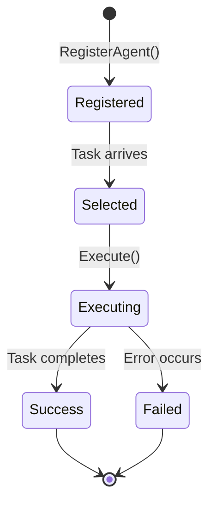

# Agents Overview

Agent Registry supports multiple AI agents with different capabilities.

## Available Agents

### 1. Gemini Agent

**Purpose**: Code generation and research

**Capabilities**:
- Code generation
- Natural language understanding
- Research and analysis
- Documentation generation

**Backend**: Google Gemini via ADK Runtime

[Learn more →](gemini.md)

### 2. Jules Agent

**Purpose**: Autonomous Git operations

**Capabilities**:
- Automated pull request creation
- Code changes and commits
- Repository management
- Branch operations

**Backend**: Jules API

[Learn more →](jules.md)

### 3. Retrieval Agent

**Purpose**: Knowledge retrieval and semantic search

**Capabilities**:
- Semantic search via ChromaDB
- Knowledge base queries
- Intelligent recommendations
- Multi-step reasoning

**Backend**: ChromaDB + ADK Runtime

[Learn more →](retrieval.md)

## Agent Capabilities Matrix

| Agent | Code Gen | Research | Git Ops | Knowledge | Multi-step |
|-------|----------|----------|---------|-----------|------------|
| **Gemini** | ✅ | ✅ | ❌ | ❌ | ✅ |
| **Jules** | ❌ | ❌ | ✅ | ❌ | ❌ |
| **Retrieval** | ❌ | ✅ | ❌ | ✅ | ✅ |

## Agent Selection

The orchestrator automatically selects agents based on task type:

```go
// Task types and corresponding agents
TaskTypeGitOps     → Jules Agent
TaskTypeCodeGen    → Gemini Agent
TaskTypeResearch   → Gemini Agent or Retrieval Agent
TaskTypeRetrieval  → Retrieval Agent
TaskTypeComplex    → Multiple agents (Swarm pattern)
TaskTypeSupervised → Jules coordinates Gemini swarm
```

## Agent Interface

All agents implement the common `Agent` interface:

```go
type Agent interface {
    Name() string
    Type() string
    CanHandle(task *Task) bool
    Execute(ctx context.Context, task *Task) (*Result, error)
}
```

## Registering Custom Agents

You can register custom agents with the orchestrator:

```go
// Implement the Agent interface
type CustomAgent struct {
    name string
}

func (a *CustomAgent) Name() string {
    return a.name
}

func (a *CustomAgent) Type() string {
    return "custom"
}

func (a *CustomAgent) CanHandle(task *Task) bool {
    return task.Type == "custom_task"
}

func (a *CustomAgent) Execute(ctx context.Context, task *Task) (*Result, error) {
    // Custom implementation
    return &Result{
        AgentName: a.Name(),
        Success:   true,
        Output:    "Custom result",
    }, nil
}

// Register with orchestrator
customAgent := &CustomAgent{name: "my-custom-agent"}
orchestrator.RegisterAgent(customAgent)
```

## Agent Communication

### Direct Execution

```go
task := &Task{
    ID:    "task-001",
    Type:  TaskTypeCodeGen,
    Input: "Generate a REST API handler",
}

result, err := geminiAgent.Execute(ctx, task)
```

### Via Orchestrator

```go
task := &Task{
    ID:          "task-001",
    Description: "Generate and deploy code",
    Type:        TaskTypeComplex,
    Input:       "Create a new API endpoint",
}

result, err := orchestrator.ExecuteTask(ctx, task)
```

### Via MCP Tools

```bash
curl -X POST http://localhost:3000/mcp/tools/execute_agent_swarm \
  -H "Content-Type: application/json" \
  -d '{
    "task_description": "Research and implement new feature",
    "agent_types": "gemini,retrieval"
  }'
```

## Agent Configuration

Each agent can be configured via AgentCatalog CRDs:

```yaml
apiVersion: agentregistry.dev/v1alpha1
kind: AgentCatalog
metadata:
  name: my-agent
spec:
  displayName: "My Custom Agent"
  agentType: "custom"
  capabilities:
    - custom_capability
  configuration:
    key: "value"
```

## Agent Lifecycle



## Best Practices

### 1. Single Responsibility

Each agent should have a clear, focused purpose:
- ✅ Jules for Git operations only
- ✅ Gemini for code generation
- ❌ Don't create multi-purpose agents

### 2. Error Handling

Always return structured errors:

```go
if err != nil {
    return &Result{
        AgentName: a.Name(),
        Success:   false,
        Error:     fmt.Errorf("failed to execute: %w", err),
    }, err
}
```

### 3. Metadata

Include useful metadata in results:

```go
return &Result{
    AgentName: a.Name(),
    Success:   true,
    Output:    output,
    Metadata: map[string]interface{}{
        "duration_ms": elapsed,
        "model_used":  "gemini-2.0-flash",
        "tokens":      1234,
    },
}
```

### 4. Timeouts

Respect context timeouts:

```go
func (a *Agent) Execute(ctx context.Context, task *Task) (*Result, error) {
    select {
    case result := <-a.doWork(task):
        return result, nil
    case <-ctx.Done():
        return nil, ctx.Err()
    }
}
```

## Next Steps

- **[Gemini Agent](gemini.md)**: Code generation details
- **[Jules Agent](jules.md)**: Git operations guide
- **[Retrieval Agent](retrieval.md)**: Knowledge retrieval with ChromaDB
- **[Orchestration](../orchestration/README.md)**: Coordinating multiple agents
