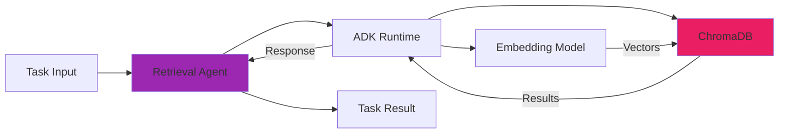

# Retrieval Agent

The Retrieval Agent provides intelligent knowledge retrieval using ChromaDB and semantic search.

## Overview

The Retrieval Agent enables natural language queries against a knowledge base stored in ChromaDB. It uses vector embeddings for semantic search and can perform multi-step reasoning for complex queries.

## Capabilities

- **Semantic Search**: Natural language queries with vector similarity
- **Knowledge Retrieval**: Access to structured knowledge base
- **Recommendations**: Intelligent suggestions based on context
- **Multi-step Reasoning**: Complex query decomposition and synthesis

## Architecture



## Configuration

### Agent Catalog

```yaml
apiVersion: agentregistry.dev/v1alpha1
kind: AgentCatalog
metadata:
  name: retrieval-agent
spec:
  displayName: "Knowledge Retrieval Agent"
  agentType: "retrieval"
  capabilities:
    - knowledge_query
    - semantic_search
    - recommendations
  configuration:
    chromaHost: "chromadb.default.svc.cluster.local"
    chromaPort: 8000
    collection: "agent_knowledge"
    embeddingModel: "text-embedding-004"
    topK: 5
    minSimilarity: 0.7
```

### Environment Variables

| Variable | Description | Default |
|----------|-------------|---------|
| `CHROMA_HOST` | ChromaDB host | `localhost` |
| `CHROMA_PORT` | ChromaDB port | `8000` |
| `CHROMA_COLLECTION` | Collection name | `agent_knowledge` |
| `EMBEDDING_MODEL` | Embedding model | `text-embedding-004` |

## ChromaDB Knowledge Base

### Collection Structure

```json
{
  "name": "agent_knowledge",
  "metadata": {
    "description": "Agent Registry knowledge base",
    "version": "1.0"
  },
  "embedding_function": "text-embedding-004"
}
```

### Document Schema

```json
{
  "id": "doc_001",
  "document": "Content of the document...",
  "metadata": {
    "source": "documentation",
    "category": "architecture",
    "tags": ["orchestration", "agents"],
    "created_at": "2024-01-15T10:00:00Z",
    "updated_at": "2024-01-15T10:00:00Z"
  },
  "embedding": [0.123, 0.456, ...]
}
```

### Populating Knowledge Base

#### Via Python Script

```python
import chromadb
from chromadb.config import Settings

# Connect to ChromaDB
client = chromadb.HttpClient(
    host="localhost",
    port=8000,
    settings=Settings(anonymized_telemetry=False)
)

# Get or create collection
collection = client.get_or_create_collection(
    name="agent_knowledge",
    metadata={"description": "Agent Registry knowledge base"}
)

# Add documents
collection.add(
    documents=[
        "Agent Registry orchestrates multiple AI agents",
        "Jules agent handles autonomous Git operations",
        "Gemini agent provides code generation capabilities"
    ],
    metadatas=[
        {"source": "docs", "category": "overview"},
        {"source": "docs", "category": "agents"},
        {"source": "docs", "category": "agents"}
    ],
    ids=["doc1", "doc2", "doc3"]
)
```

#### Via REST API

```bash
# Add documents
curl -X POST http://localhost:8000/api/v1/collections/agent_knowledge/add \
  -H "Content-Type: application/json" \
  -d '{
    "documents": ["Your knowledge content"],
    "metadatas": [{"source": "api", "category": "custom"}],
    "ids": ["custom_doc_1"]
  }'
```

#### Bulk Import

```python
import json
import chromadb

# Load documents from JSON
with open('knowledge_base.json', 'r') as f:
    data = json.load(f)

client = chromadb.HttpClient(host="localhost", port=8000)
collection = client.get_or_create_collection("agent_knowledge")

# Batch add
batch_size = 100
for i in range(0, len(data['documents']), batch_size):
    batch = data['documents'][i:i+batch_size]
    collection.add(
        documents=[doc['content'] for doc in batch],
        metadatas=[doc['metadata'] for doc in batch],
        ids=[doc['id'] for doc in batch]
    )
```

## Usage Examples

### Simple Query

```bash
# Via MCP tool
curl -X POST http://localhost:3000/mcp/tools/query_knowledge \
  -H "Content-Type: application/json" \
  -d '{
    "query": "How does the orchestrator coordinate agents?",
    "top_k": 5
  }'
```

### Orchestrated Query

```bash
# Use retrieval agent in orchestration
curl -X POST http://localhost:3000/mcp/tools/orchestrate_complex_task \
  -H "Content-Type: application/json" \
  -d '{
    "description": "Research best practices for multi-agent coordination and generate implementation code",
    "context": "Focus on production deployments"
  }'
```

### Programmatic Usage

```go
// Create retrieval task
task := &orchestrator.Task{
    ID:          "retrieval-001",
    Description: "Find documentation about agent capabilities",
    Type:        orchestrator.TaskTypeRetrieval,
    Input:       "What are the capabilities of the Gemini agent?",
}

// Execute via orchestrator
result, err := orch.ExecuteTask(ctx, task)
if err != nil {
    log.Fatal(err)
}

// Access results
knowledge := result.Output.(string)
fmt.Println(knowledge)
```

## Query Types

### 1. Direct Retrieval

Simple semantic search:

```json
{
  "query": "What is the orchestrator?",
  "top_k": 3
}
```

### 2. Filtered Search

Search with metadata filters:

```json
{
  "query": "agent deployment",
  "filters": {
    "category": "architecture",
    "tags": {"$contains": "kubernetes"}
  },
  "top_k": 5
}
```

### 3. Multi-step Reasoning

Complex queries decomposed into steps:

```json
{
  "query": "Compare the capabilities of Jules and Gemini agents, then recommend which to use for automated code reviews",
  "reasoning_steps": true
}
```

## Performance Optimization

### Embedding Caching

```go
// Cache embeddings for frequently queried terms
cache := make(map[string][]float64)

func getEmbedding(text string) []float64 {
    if cached, ok := cache[text]; ok {
        return cached
    }
    embedding := generateEmbedding(text)
    cache[text] = embedding
    return embedding
}
```

### Batch Queries

```python
# Query multiple documents at once
results = collection.query(
    query_texts=[
        "orchestration patterns",
        "agent capabilities",
        "deployment guide"
    ],
    n_results=3
)
```

## Monitoring

### Query Metrics

- Query latency
- Result relevance scores
- Cache hit rate
- ChromaDB connection health

### Logs

```bash
# View retrieval agent logs
kubectl logs -n agentregistry-system -l app=agent-registry-controller | grep retrieval
```

## Troubleshooting

### ChromaDB Connection Issues

```bash
# Test ChromaDB connectivity
curl http://chromadb:8000/api/v1/heartbeat

# Check collection exists
curl http://chromadb:8000/api/v1/collections/agent_knowledge
```

### Low Relevance Scores

- Adjust `minSimilarity` threshold
- Improve document quality and metadata
- Use more specific queries
- Consider different embedding models

### Performance Issues

- Enable embedding caching
- Use batch queries
- Scale ChromaDB horizontally
- Optimize collection size

## Next Steps

- **[Gemini Agent](gemini.md)**: Code generation capabilities
- **[Jules Agent](jules.md)**: Git operations
- **[Orchestration Examples](../orchestration/examples.md)**: Multi-agent workflows
