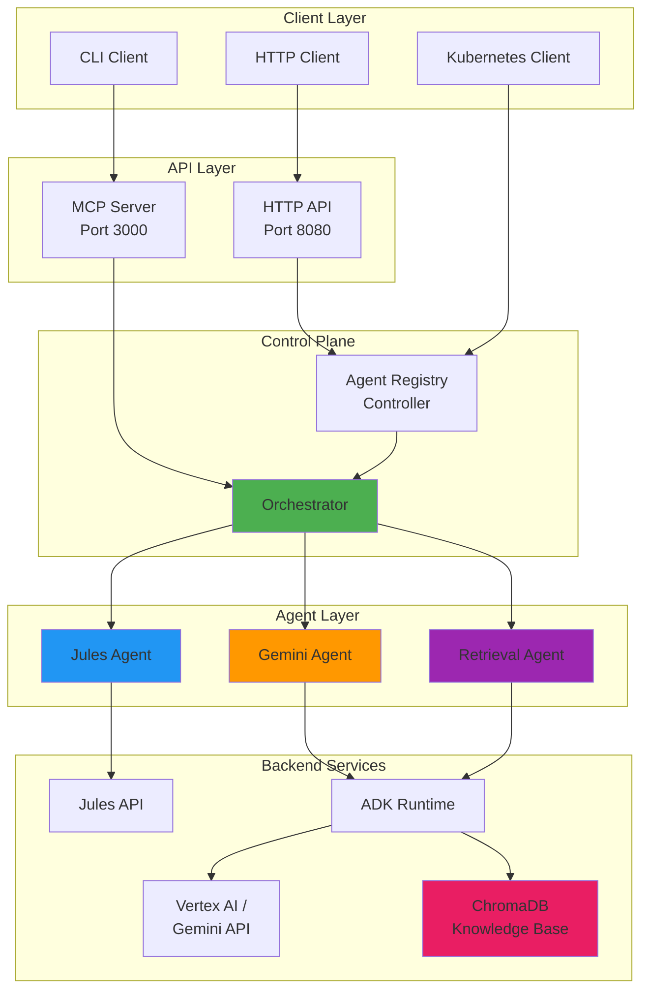
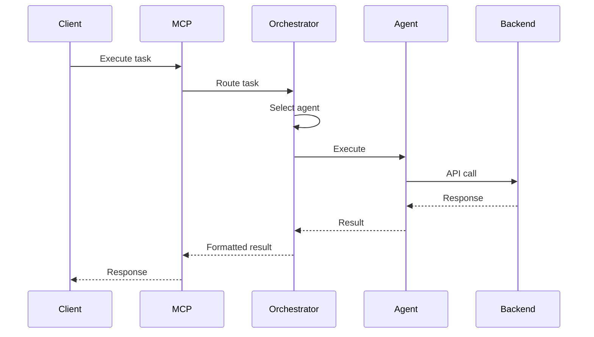
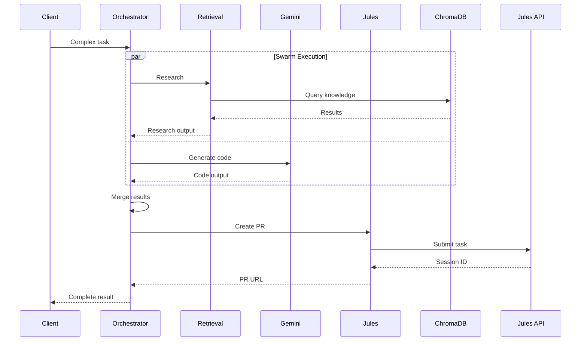

# Architecture Overview

Agent Registry is a Kubernetes-native platform for orchestrating multiple AI agents with different capabilities.

## System Architecture

## Core Components

### 1. Controller

The Kubernetes controller manages the lifecycle of agent resources:

- **AgentCatalog**: Defines available agents and their capabilities
- **AgentDeployment**: Manages agent instances and scaling
- **DiscoveryConfig**: Configures agent discovery mechanisms

**Location**: `cmd/controller/main.go`

### 2. Orchestrator

Coordinates multiple agents to execute complex tasks:

- **Agent Registry**: Manages registered agents
- **Task Router**: Selects appropriate agents for tasks
- **Execution Patterns**: Supervisor, Swarm, Workflow

**Location**: `internal/orchestrator/`

### 3. MCP Server

Model Context Protocol server for agent discovery and interaction:

- **Tools**: Expose agent capabilities as MCP tools
- **Resources**: Provide agent metadata and documentation
- **Prompts**: Offer pre-built prompts for common tasks

**Location**: `internal/mcp/`

### 4. ADK Runtime

Agent Development Kit runtime for Gemini and Retrieval agents:

- **Gemini Integration**: Code generation and research
- **ChromaDB Integration**: Knowledge retrieval and semantic search
- **Multi-step Reasoning**: Complex query processing

**Location**: `internal/adk/`

## Data Flow

### Simple Task Execution

### Complex Multi-Agent Task

## Key Design Principles

### 1. Kubernetes Native

All components are designed to run in Kubernetes:
- Custom Resource Definitions (CRDs)
- Controller pattern
- Declarative configuration
- Horizontal scaling

### 2. Extensible

Easy to add new agents:
- Agent interface for custom implementations
- Plugin architecture
- Dynamic agent registration

### 3. Observable

Built-in observability:
- Structured logging (zerolog)
- Metrics (Prometheus)
- Tracing (OpenTelemetry)
- Status reporting

### 4. Resilient

Production-ready reliability:
- Retry mechanisms
- Timeout handling
- Error recovery
- Health checks

## Storage

### ChromaDB Knowledge Base

Persistent knowledge storage for the Retrieval agent:

- **Vector Embeddings**: Semantic search capabilities
- **Collections**: Organized knowledge domains
- **Metadata**: Rich document metadata
- **Persistence**: Durable storage with PVCs

**Integration**: `internal/adk/retrieval_agent.go`

### Kubernetes State

Agent and deployment state stored in etcd via Kubernetes API:

- **AgentCatalogs**: Agent definitions
- **AgentDeployments**: Deployment specifications
- **DiscoveryConfigs**: Discovery settings

## Security

### Authentication

- **Jules API**: API key authentication
- **Google Cloud**: Service account or API key
- **MCP Server**: Optional authentication (configurable)

### Authorization

- **Kubernetes RBAC**: Controller permissions
- **Agent Capabilities**: Capability-based access control

### Secrets Management

- **Kubernetes Secrets**: API keys and credentials
- **Environment Variables**: Runtime configuration

## Scalability

### Horizontal Scaling

- **Controller**: Multiple replicas with leader election
- **MCP Server**: Stateless, can scale horizontally
- **Agents**: Concurrent execution support

### Performance

- **Parallel Execution**: Swarm pattern for concurrent tasks
- **Caching**: Result caching in orchestrator
- **Connection Pooling**: Efficient backend connections

## Next Steps

- **[Orchestrator](orchestrator.md)**: Deep dive into orchestration
- **[Agents](agents.md)**: Agent system design
- **[MCP Server](mcp-server.md)**: MCP integration details
