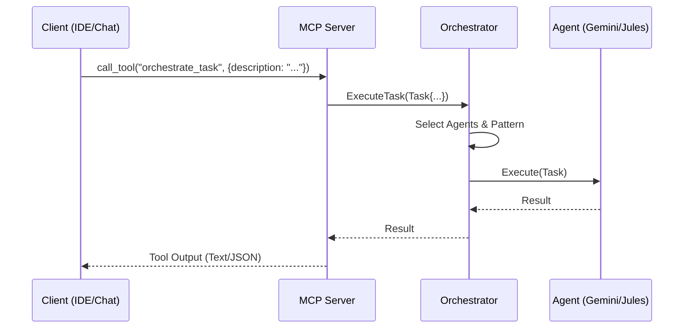

# MCP Server Architecture

The Model Context Protocol (MCP) Server is the bridge between the internal Agent Registry capabilities and external clients (such as IDEs, Chat interfaces, or other MCP-compliant tools).

## Overview

The MCP Server exposes the Agent Registry's functionality as a set of standardized "Tools" and "Resources". It translates MCP JSON-RPC messages into internal API calls.

## Key Components

### 1. Server Definition (`internal/mcp/server.go`)

The `MCPServer` struct encapsulates the server state and dependencies:

```go
type MCPServer struct {
    Client       client.Client       // K8s client for catalog access
    AdkRuntime   *adk.ADKRuntime     // Access to LLMs
    JulesClient  *orchestrator.JulesClient
    Orchestrator *orchestrator.Orchestrator
    // ... basic MCP server fields
}
```

It supports the `WithOrchestrator` option pattern for flexible initialization.

### 2. Tool Registration

Tools are the primary way to execute actions. We define tools in modular files:

*   **`tools.go`**: General registry tools (listing agents, getting status).
*   **`tools_jules.go`**: Jules-specific tools (`execute_jules_git_task`).
*   **`tools_orchestrator.go`**: High-level orchestration tools (`orchestrate_complex_task`).

#### Example Tool Definition

```go
mcp.Tool{
    Name:        "orchestrate_complex_task",
    Description: "Execute a complex task using multi-agent orchestration",
    InputSchema: completionOrchestrationSchema, // JSON Schema for arguments
}
```

### 3. Request Handling

When an external client calls a tool:

1.  **Transport**: The message arrives via Stdio (or HTTP/SSE in the future).
2.  **Routing**: The MCP SDK routes the `call_tool` request to the registered handler.
3.  **Handler Execution**:
    *   Example: `handleExecuteSupervisedTask`
    *   Parses arguments.
    *   Constructs an internal `orchestrator.Task`.
    *   Calls `server.Orchestrator.ExecuteTask(ctx, task)`.
    *   Formats the `orchestrator.Result` back into an MCP `CallToolResult` (usually text or JSON).

## Resources & Prompts

*   **Resources**: Read-only data exposed to the client. We use this to expose the Agent Catalog (list of available agents) as a resource.
*   **Prompts**: Standardized prompt templates that can be used by the client to structure requests effectively (e.g., "Code Review Prompt").

## Integration Flow



## Security & Access

Currently, the MCP Server runs with the permissions of the starting process (usually the user's local credentials or a Kubernetes Service Account). It trusts the inputs provided via the MCP connection.

## Extensibility

Adding a new tool involves:

1.  Defining the request/response schema.
2.  Implementing a handler method on the `MCPServer`.
3.  Registering the tool in `NewMCPServer` or `RegisterTools`.
