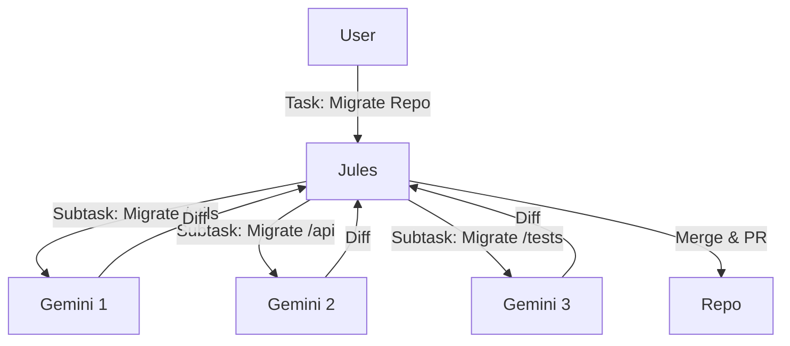

# Jules Workflows

This guide focuses on integrating the Jules Agent into your workflows to automate Git operations.

## Capabilities

Jules is not just a "commit bot". It handles the full lifecycle of a code change:
1.  **Checkout**: Cloning/fetching repositories.
2.  **Edit**: Applying complex diffs.
3.  **Commit**: Writing semantic commit messages.
4.  **Push**: Handling upstream synchronization.
5.  **PR**: Creating Pull Requests with detailed descriptions.

## Common Scenarios

### 1. The "Auto-Fixer"

Automatically fix linting errors or test failures.

**Workflow**:
1.  CI/CD pipeline fails.
2.  Trigger Jules with the error log and the relevant file.
3.  Jules analyzes the error, patches the code, and pushes a fix commit.

### 2. Dependency Updates

Keep dependencies up to date with intelligence.

**Workflow**:
1.  Identify outdated packages (external tool).
2.  Trigger Jules for each package.
3.  Jules updates `go.mod`/`package.json`, runs `go mod tidy`/`npm install`, and creates a PR named `chore/update-<package>`.

### 3. Feature Skeleton Generation

Bootstrap new microservices or components.

**Workflow**:
1.  Gemini generates a project structure (files and content).
2.  Jules takes this structure and initializes a new repository (or folder), creating the first PR with the boilerplate.

## Advanced Usage: The "Supervised" Pattern

Jules can act as a **Supervisor** for a swarm of Gemini agents. This is useful when the task is too large for a single context window.

**Scenario**: Migration from Python 2 to 3.

In this pattern, Jules manages the Git state (branches, merges) while delegating the actual code intelligence to Gemini instances.

## Configuration Tips

*   **Timeouts**: Git operations can be slow. Set `timeout: 600s` or higher for large repos.
*   **Authentication**: Ensure your Jules API key has permissions for the target repositories.
*   **Branching Strategy**: Always work on feature branches, never directly on `main`/`master`.
