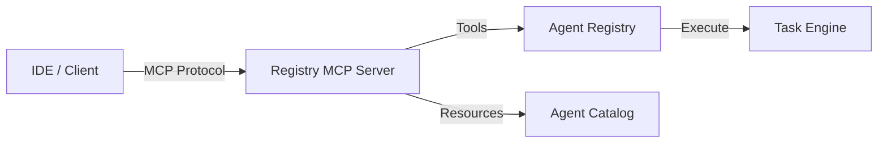

# Model Context Protocol (MCP)

The Agent Registry implements the [Model Context Protocol (MCP)](https://modelcontextprotocol.io), an open standard for connecting AI assistants to data and tools.

## What is MCP?

MCP allows AI models (like Gemini) to access external "Context" in a standardized way. Context can be:

*   **Tools**: Executable functions (e.g., "Create a file", "Run a test").
*   **Resources**: Read-only data (e.g., "List of source files", "Database records").
*   **Prompts**: Reusable prompt templates (e.g., "Code Review Checklist").

## Agent Registry Implementation

The Registry acts as an **MCP Server**. This means any MCP-compliant client (like Claude Desktop, Zed, or a custom IDE extension) can connect to it and use the registered agents as tools.

### Architecture



## Connection Configuration

To connect a client to the Agent Registry MCP server:

### Kubernetes / Remote
```json
{
  "mcpServers": {
    "agent-registry": {
      "command": "kubectl",
      "args": ["exec", "-i", "deploy/agent-registry", "--", "agent-registry", "mcp"]
    }
  }
}
```

### Local Development
```json
{
  "mcpServers": {
    "agent-registry-local": {
      "command": "go",
      "args": ["run", "./cmd/controller/main.go", "mcp"]
    }
  }
}
```

## Security

The MCP server currently assumes it is running in a trusted environment (like a local machine or a secured pod). Authentication features are planned for future releases.
