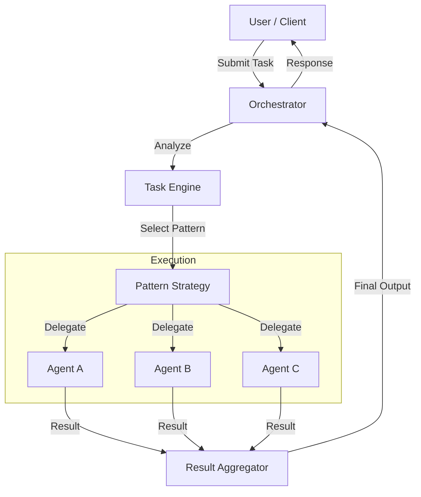

# Orchestration Overview

Orchestration is the process of coordinating one or more AI agents to solve a complex problem. The Agent Registry provides a robust orchestration engine that supports flexible patterns, task management, and result aggregation.

## Why Orchestration?

Single LLM calls are powerful, but limited. Orchestration allows you to:
*   **Break down complex tasks** into smaller, manageable subtasks.
*   **Leverage specialized agents** (e.g., one for coding, one for research, one for security review).
*   **Coordinate parallel work** to speed up execution.
*   **Maintain state** across multi-step workflows.
*   **Integrate external tools** (Git, Databases) seamlessly.

## Key Concepts

### Tasks
The fundamental unit of work. A task describes *what* needs to be done, including type, description, and input data.

### Agents
The workers that execute tasks. Agents can be generic (LLMs) or specialized (Tools).

### Patterns
The "shape" of the collaboration. Does one agent manage others? Do they vote? Is it a linear pipeline?

## High-Level Architecture

## Getting Started

To explore the orchestration capabilities:

1.  Review the [Orchestration Patterns](patterns.md) to understand the available strategies.
2.  Learn about [Task definitions](tasks.md) to structure your requests.
3.  See [Real-world Examples](examples.md) to get inspired.
