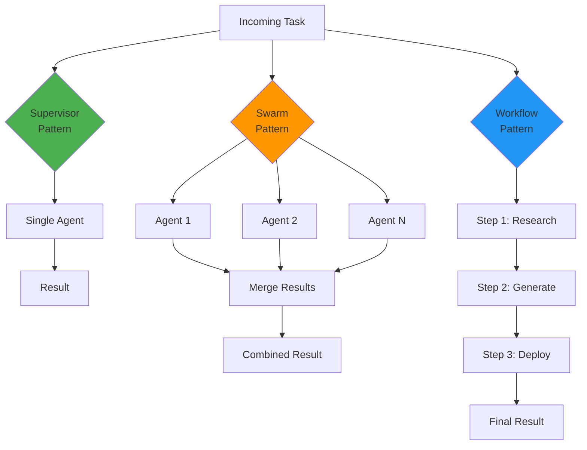
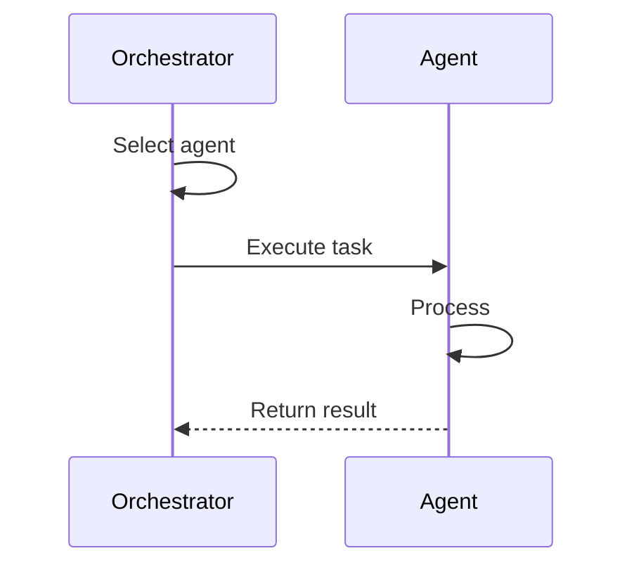
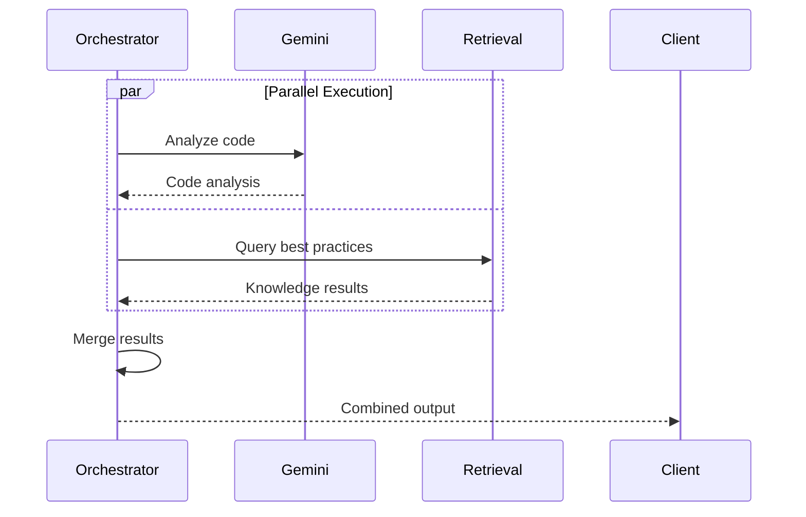
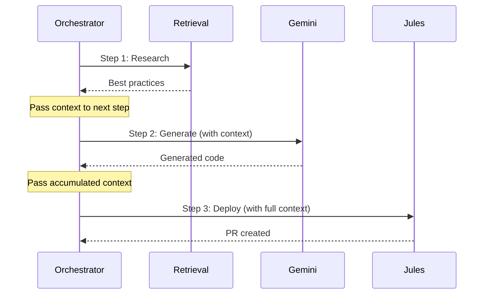
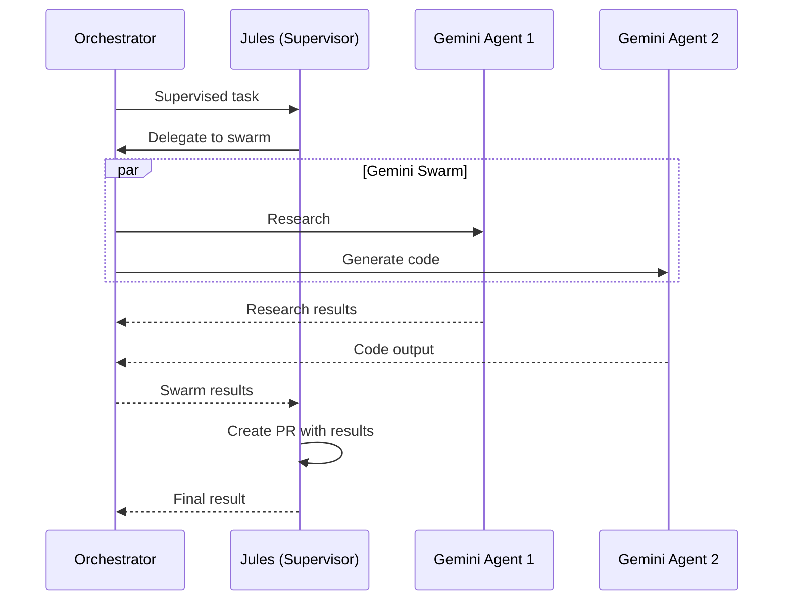

# Orchestration Patterns

Agent Registry supports three coordination patterns for multi-agent workflows.

## Pattern Overview



## 1. Supervisor Pattern

**Use Case**: Single agent handles the entire task

**When to Use**:
- Simple, focused tasks
- Single capability required
- No coordination needed

**Example**:

```go
task := &Task{
    ID:          "git-001",
    Description: "Create PR with bug fix",
    Type:        TaskTypeGitOps,
    Input: JulesTaskInput{
        Repository: "myorg/myrepo",
        Prompt:     "Fix null pointer in auth handler",
        Branch:     "main",
    },
}

result, err := orchestrator.ExecuteTask(ctx, task)
// Jules agent handles entire task
```

**Flow**:



## 2. Swarm Pattern

**Use Case**: Multiple agents execute in parallel

**When to Use**:
- Complex tasks requiring multiple capabilities
- Independent sub-tasks
- Need diverse perspectives

**Example**:

```go
task := &Task{
    ID:          "complex-001",
    Description: "Analyze codebase and suggest improvements",
    Type:        TaskTypeComplex, // Triggers swarm
    Input:       "Review authentication module",
}

result, err := orchestrator.ExecuteTask(ctx, task)
// Gemini + Retrieval agents execute in parallel
```

**Flow**:



**Result Merging**:

```go
func (o *Orchestrator) mergeResults(results []*Result) *Result {
    merged := &Result{
        AgentName: "orchestrator",
        Success:   true,
        Output:    make(map[string]interface{}),
        Metadata:  make(map[string]interface{}),
    }
    
    for _, r := range results {
        if !r.Success {
            merged.Success = false
        }
        merged.Output[r.AgentName] = r.Output
        merged.Metadata[r.AgentName+"_metadata"] = r.Metadata
    }
    
    return merged
}
```

## 3. Workflow Pattern

**Use Case**: Sequential task execution with context passing

**When to Use**:
- Multi-step processes
- Each step depends on previous results
- Need to build context progressively

**Example**:

```go
tasks := []*Task{
    {
        ID:   "step1",
        Type: TaskTypeRetrieval,
        Input: "Research microservices best practices",
    },
    {
        ID:   "step2",
        Type: TaskTypeCodeGen,
        Input: "Generate microservice template",
    },
    {
        ID:   "step3",
        Type: TaskTypeGitOps,
        Input: JulesTaskInput{
            Repository: "myorg/services",
            Prompt:     "Add new microservice",
        },
    },
}

result, err := orchestrator.ExecuteWorkflow(ctx, tasks)
```

**Flow**:



**Context Passing**:

```go
func (o *Orchestrator) ExecuteWorkflow(ctx context.Context, tasks []*Task) (*Result, error) {
    context := make(map[string]interface{})
    
    for i, task := range tasks {
        // Add previous results to context
        task.Context = context
        
        result, err := o.ExecuteTask(ctx, task)
        if err != nil {
            return nil, err
        }
        
        // Accumulate context
        context[fmt.Sprintf("step_%d", i)] = result.Output
    }
    
    return &Result{
        Success: true,
        Output:  context,
    }, nil
}
```

## 4. Supervised Pattern (Advanced)

**Use Case**: Jules coordinates a Gemini swarm

**When to Use**:
- Need AI research + autonomous Git operations
- Want Jules to supervise the entire process
- Complex multi-agent coordination

**Example**:

```go
task := &Task{
    ID:          "supervised-001",
    Description: "Research, implement, and deploy feature",
    Type:        TaskTypeSupervised,
    Input: JulesTaskInput{
        Repository: "myorg/app",
        Prompt:     "Add OAuth2 authentication",
    },
}

result, err := orchestrator.ExecuteTask(ctx, task)
// Jules coordinates Gemini swarm, then creates PR
```

**Flow**:



## Pattern Selection

The orchestrator automatically selects patterns based on task type:

| Task Type | Pattern | Agents |
|-----------|---------|--------|
| `git_ops` | Supervisor | Jules |
| `code_gen` | Supervisor | Gemini |
| `research` | Supervisor | Gemini or Retrieval |
| `retrieval` | Supervisor | Retrieval |
| `complex` | Swarm | All capable agents |
| `supervised` | Supervised | Jules + Gemini swarm |

## MCP Tool Usage

### Supervisor Pattern

```bash
curl -X POST http://localhost:3000/mcp/tools/execute_jules_git_task \
  -d '{"repository": "owner/repo", "prompt": "Add tests"}'
```

### Swarm Pattern

```bash
curl -X POST http://localhost:3000/mcp/tools/execute_agent_swarm \
  -d '{"task_description": "Analyze and improve code", "agent_types": "gemini,retrieval"}'
```

### Supervised Pattern

```bash
curl -X POST http://localhost:3000/mcp/tools/execute_supervised_task \
  -d '{"description": "Research and implement feature X"}'
```

## Best Practices

### 1. Choose the Right Pattern

- **Simple tasks** → Supervisor
- **Parallel analysis** → Swarm
- **Multi-step processes** → Workflow
- **AI + Git automation** → Supervised

### 2. Handle Failures

```go
result, err := orchestrator.ExecuteTask(ctx, task)
if err != nil {
    log.Error().Err(err).Msg("task failed")
    return err
}

if !result.Success {
    log.Warn().Interface("result", result).Msg("task unsuccessful")
}
```

### 3. Use Timeouts

```go
ctx, cancel := context.WithTimeout(context.Background(), 5*time.Minute)
defer cancel()

result, err := orchestrator.ExecuteTask(ctx, task)
```

### 4. Monitor Progress

```go
// Add logging to track progress
orchestrator.Logger().Info().
    Str("task_id", task.ID).
    Str("pattern", "swarm").
    Msg("executing task")
```

## Next Steps

- **[Tasks](tasks.md)**: Task types and execution
- **[Examples](examples.md)**: Real-world workflows
- **[MCP Tools](../mcp/tools.md)**: Tool reference
